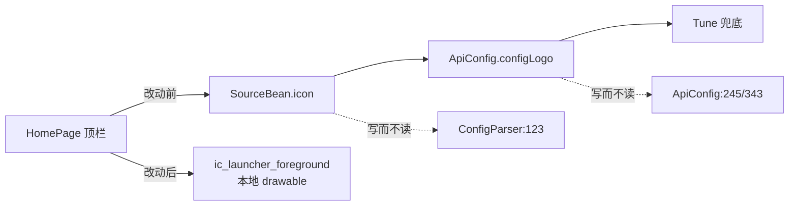

# 0. 覆盖度声明

- 审查范围：`git status` 的全部 9 个改动文件（M，无新增/删除文件）。范围外文件仅在"消费方"意义上被读（`ApiConfig`、`SourceBean`、`SourceRuntimeState`、`HomeGridLayout.kt` 全文、`SourceResultParserRoutingTest.kt`）。
- 锚点类逐个点名：`SortLoader` 读过 ✓、`ListLoader` 读过 ✓、`SourceResultParser` 读过 ✓、`HomeViewModel`（Kotlin）读过 ✓、`HomePage`/`HomeGridLayout` 读过 ✓（改动段 + 相邻 context）、`AbsSortXml` 读过 ✓、`LOG` 读过 ✓、`BoundedCall` 读过 ✓、`SourceViewModel` 门面读过 ✓（确认 `sortResult` 通道无第二消费者）。
- 未展开：`player` 模块、`osc/player`、直播链（本批未触碰）；参考实现、`quickjs/`、`pyramid/`、`libs/` 按排除范围跳过。
- 所用工具与命令：`git diff`（工作区 vs HEAD，508 行落盘后逐行读）；`grep` 语义检索定位消费方（`getConfigLogo`、`setIcon`、`sortLoadFailed`、`postSortFailure`、`echo--` 前缀）；**临时探针单测**实证解析层形状（`TempSortJsonShapeTest`，4 例全绿后已删除，工作区已复原）；`.\gradlew.bat :app:assembleDebug :app:testDebugUnitTest`（日志落盘再读，未用管道过滤）。
- 验证结果：`BUILD SUCCESSFUL in 58s`；`app/build/test-results/testDebugUnitTest/*.xml` **61 类 / 468 例 / 0 失败 / 0 错误**（与 `refactor-plan-20261001.md` 记录的 58 类 / 455 例基线相比 +3 类 +13 例，来自本批之前的提交，非本次改动）。Kotlin 编译无新增 warning（日志仅 Gradle 自身的 deprecation WARNING）。

## 本批改动的意图还原（三组，互不耦合）

| 组 | 内容 | 判定 |
| --- | --- | --- |
| A | 首页"取数失败"与"确实没内容"区分：`AbsSortXml.loadFailed` 标记 + `SortLoader.postSortFailure` 出口 + `HomeViewModel` 一次自动重试/错误态 + 两套布局的错误卡与手动重试 | **有缺陷**（发现 1、2） |
| B | 首页源胶囊 logo 改为本地 `ic_launcher_foreground`（`drawBehind` + 1.5× 复刻桌面图标占比） | 可用，遗留死代码（发现 4） |
| C | `echo--` 诊断日志（`ListLoader`/`SortLoader`/`SourceResultParser`/`HomeViewModel`/`BoundedCall`/`LOG` 前缀表） | 可接受，见 §2 |

---

# 1. 项目架构评价（本批视角）

- 失败态的表达方式选得对：没有在 UI 层猜"空列表 = 失败"，而是让数据层显式回报失败（`loadFailed` 标记），重试与错误态归 `HomeViewModel`，两套布局（列表 / 竖向网格）各自只读一个 `StateFlow`。分层没有被破坏，`sourceKey` 归位守卫（`absXml.sourceKey != key` 即丢）在新增失败分支之前，换源串包的既有防护未被绕过。
- `postSortFailure` 与既有 `postSortResult` 并列成"成功/失败两个出口"，是这个包一贯的写法；`transient` 修饰 `loadFailed` 也与 XStream 序列化语义相容（`sortCache` 里读回恒为 false，正是想要的）。
- 欠缺一处：**"失败"的定义没有在数据层收敛**。当前把"请求失败"和"响应成功但没有分类/没有推荐"混成同一个标记，于是把大量正常站点判成失败——这正是发现 1 的根因，不是笔误而是口径问题。

# 2. 值得保留的设计

- `HomeViewModel.retryPartition` 补的 `listRetried.remove(id)`：手动重试后允许再获得一次自动重试配额，语义自洽，也避免了"重试按钮点了没反应"。
- `LOG.FILE_LOG_PREFIXES` 一次性补齐 `echo--list` / `echo--getList` / `echo--parse` / `echo--getSort` / `echo--sort` 五个前缀，与既有 `echo-` 体例一致，落盘只在 `BuildConfig.DEBUG` 生效——本批新增的日志属于**排查用脚手架**，风格上与 `echo-preload` / `echo-exo` 等存量完全一致，不作为问题。
- 竖向网格把 `HomeGridHint` 的 `onRetry` 设为可选参数（既有调用点零改动），横向列表复用 `LoadStateBox` 的 `retryText`/`onRetry` 对——没有为错误态新造组件。

---

# 3. 问题清单

## 发现 1（高 · 本次引入）"成功但内容为空"被当作取数失败，正常站点被判死

- 位置：`app/src/main/java/com/github/tvbox/osc/sourcedata/SortLoader.java:265`，锚点 `postSortFailure(sourceKey);`（`getSortFromApi` 的 `onSuccess` 内）
- 同源同类（同一次改动引入，合并计 1 条）：
  - `SortLoader.java:211` — 锚点 `postSortFailure(sourceKey);`（`getSortFromSpider`，`sortXml != null` 但取不到推荐视频）
  - `SortLoader.java:325` — **（修复轮订正为误报）** `getSortFromExtendedApi` 的 GET 成功分支本就有 `listLoader.getHomeRecList(...)` 回调兜底（`:322-331`），解析成功但无推荐时仍会回包；删除这里的 `postSortResult` 无行为影响，故**不修**。订正依据见附录 C 第 4 点。
- 描述：改动前这两处是 `postSortResult(sourceKey, sortXml)` + `cacheSort(...)`，即"解析成功、只是没有推荐位"照常出分类；改为无条件 `postSortFailure` 后，`HomeViewModel` 走 `sortRetried` 分支**再打一次站点请求**，仍失败（标记依旧）⇒ 置 `sortLoadFailed`、清空 `sorts`/`partitions`/`allSorts`，首页整页变成「加载失败，请检查网络」——而解析出来的分类被直接丢弃。**（2026-10-02 已修，见附录 C）**
- 触发条件是"站点返回的分类列表为空 / 没有推荐位"，不是网络故障。本仓库三条链路都真实可达：
  - type 3 爬虫 `homeContent` 只给 class 不给推荐视频（`homeVideoContent` 返回空是常态）；
  - type 1/4 JSON `{"class":[...]}` 无 `list` 键（`AbsSortJson.toAbsSortXml()` 在 `list == null` 时明确置 `absSortXml.list = null`）；
  - type 0 XML 只有 `<class>`。
- 证据（现状）：
  ```java
  // getSortFromApi.onSuccess
  attachSortSource(sourceKey, sortXml);
  if (withRec && sortXml != null && sortXml.list != null && sortXml.list.videoList != null && sortXml.list.videoList.size() > 0) {
      ... listLoader.getHomeRecList(...)
  } else {
      postSortFailure(sourceKey);   // 原为 postSortResult + cacheSort
  }
  ```
- 实证（临时探针单测，4 例全绿，已删除；行号为探针文件内位置）：`{"class":[]}` ⇒ 非 null 且 `sortList` 为空；`{"list":[]}`（无 class 键）⇒ 非 null 且 `sortList` 为空；`{"class":[{type_id,type_name}]}` ⇒ 非 null、`sortList` 有 1 项且 `list == null`；只有 `not-json` 才返回 null。⇒ **`sortXml != null` 只代表"解析没抛异常"，不能用来判定成功/失败**；这些 `else` 分支里 `sortXml` 是有效对象。
- 建议：把 `postSortFailure` 只留给"真的没拿到可用响应"（响应 null / `IOException` / 超时 / 解析抛异常，即 `sortXml == null`）；`sortXml != null` 但无推荐位的分支恢复 `postSortResult` + `cacheSort`，失败态由 `HomeViewModel` 侧的"空分类"自行呈现（现状已有 `PartitionState.Empty` / 空内容文案）。**（已按此修，见附录 C）**

## 发现 2（中 · 本次引入）type 4 POST 回退分支：解析成功但无推荐时既不投结果也不投失败，请求静默挂起

- 位置：`app/src/main/java/com/github/tvbox/osc/sourcedata/SortLoader.java:360-369`，锚点 `if (sortXml != null) { ... } else { postSortFailure(sourceKey); }`
- 描述：`sortXml != null` 且 `absXml.movie.videoList` 为空时，既不 `postSortResult`（原实现会）也不 `postSortFailure` ⇒ `sortResult` 通道全程无回包。`HomeViewModel.loadHome()` 已 `armWatchdog()`，20s 后 `onHomeLoadTimeout()` 把 `rec` 置为 `Error` 并弹「首页加载超时」，看到的是"超时"而非真实成因。
- 触发条件：extend 编码后 URL 超长（`URLEncoder.encode(extend).length() >= 1000`）走 `RemoteTVBox.post`，且站点返回无推荐视频——概率低但路径确实存在。
- 证据：
  ```java
  final AbsSortXml sortXml = resultParser.sortJson(sortResult, sortJson);
  attachSortSource(sourceKey, sortXml);
  if (sortXml != null) {
      AbsXml absXml = resultParser.json(null, sortJson, sourceBean.getKey());
      if (absXml != null && absXml.movie != null && absXml.movie.videoList != null && absXml.movie.videoList.size() > 0) {
          sortXml.videoList = absXml.movie.videoList;
          postSortResult(sourceKey, sortXml);
          cacheSort(sourceKey, sortXml);
      }                       // ← 无 else：这里什么都不发
  } else {
      postSortFailure(sourceKey);
  }
  ```
- 建议：补 `else { postSortResult(sourceKey, sortXml); cacheSort(sourceKey, sortXml); }`（与同一方法内 `onSuccess` 分支同形），保证该分支"必有回包"。**（2026-10-02 已修，见附录 C）**

## 发现 3（低 · 本次引入）`retrySort()` 未清 `listRetried`，`sortRetried` 置位语义偏紧

- 位置：`app/src/main/java/com/github/tvbox/osc/ui/page/HomeViewModel.kt:214-223`，锚点 `fun retrySort() {`
- 描述：`retrySort()` 重置了 `sortLoadFailed` / `rec` / `sortsLoaded` / `pageLoading`，但没清 `listRetried`。当前无可见后果（失败态路径在 `partitions` 被清空后提前 return，不会产生分区请求），但下一次改动若让失败态仍保留分区，就会"重试后分区不再自动重试"。另 `retrySort()` 里 `sortRetried = true` 使手动重试后不再有自动重试，属有意选择，但注释未写明。
- 证据：
  ```kotlin
  fun retrySort() {
      val key = loadingSourceKey ?: return
      sortLoadFailed.value = false
      sortRetried = true
      ...
  ```
- 建议：与 `loadHome()` 对齐，补 `listRetried.clear()`；`sortRetried = true` 加半句为什么（"手动重试即已消耗自动重试配额，避免连环重试"）。

## 发现 4（低 · 本次引入）首页顶栏不再消费站点 `icon` 与配置级 `logo`，留下写而不读的死状态

- 位置：`app/src/main/java/com/github/tvbox/osc/ui/page/HomePage.kt:168`，锚点 `val capsuleLogo = remember { ContextCompat.getDrawable(context, R.drawable.ic_launcher_foreground) }`
- 描述：`HomePage` 原本优先显示订阅源图标、其次配置级 logo、最后 `Icons.Filled.Tune` 兜底；现在恒为 App 自身启动图标。改动没有任何行为注释说明"为什么不再显示站点图标"，且**全库再无读者**：
  - `ApiConfig.java:79 getConfigLogo()` — 改动前唯一消费者是 `HomePage`，现在零引用（`grep getConfigLogo` 命中 1 处，即定义本身）；`configLogo` 字段只剩 `ApiConfig.java:245` 重置、`:343` 赋值，**写而不读**。
  - `SourceBean.icon` 仍由 `ConfigParser.java:123 sb.setIcon(...)` 写入，同样**写而不读**。
- 证据：
  ```kotlin
  // 自适应图标前景层在系统内的缩放系数，此处复刻以呈现与桌面图标一致的 logo 占比
  private const val CapsuleLogoZoom = 1.5f
  ```
- 判断：图标几何自洽（`ic_launcher_foreground` 视觉内容在 108dp 视口内约居 484–700/1024 区间，39dp 画布×设计视口折算后内容约 25dp，26dp 圆角盒内不裁切），所以这更像**刻意的品牌化**而非回归；但"站点图标/配置 logo 不再有展示位置"是行为变更，必须由人确认。
- 建议：二选一并登记——① 确认长期品牌化 ⇒ 独立一笔清掉 `getConfigLogo()` 与 `SourceBean.icon` 的写侧（当前是纯死代码，属"既有 + 本次被放大"）；② 只是暂时收敛 ⇒ 补一句为什么的注释，并在真机走查项里记"顶栏不再反映当前订阅源"。`CapsuleLogoZoom = 1.5f` 建议进真机走查清单（自适应图标蒙版不同 ROM 下占比可能偏差，仅静态推理无法判定观感）。

---

# 4. 重构决策

**A：不需要重构，继续开发。** 本批是"补失败态 + 换图标 + 加日志"的点状改动，结构无需调整；发现 1/2 都是把 `else` 分支的出口口径写错，属就地修正（各 1–3 行）。发现 4 的清理可以完全独立成一笔。

# 5. 优先级

- **P0**：发现 1（`SortLoader.java` 的 `:211`、`:265` 两处）、发现 2（`SortLoader.java:360-369`）——同一个根因（"成功但空"当成失败 + 该发的回包没发）。**2026-10-02 已修完并复验（附录 C）**。
- **P1**：发现 4（dead state 清理或注释固化 + 真机确认顶栏观感）。
- **P2**：发现 3（`retrySort` 状态对齐）。

# 6. 渐进式重构计划

不适用（决策 A）。修复建议切分：`fix(home): distinguish empty sort payload from a failed request`（发现 1+2，一笔）；`chore(api): drop the now-unread config logo plumbing`（发现 4 选项①，独立一笔，可回滚）。

## 附录 A. 度量盘点（必出）

口径：`Get-ChildItem -Recurse -Include *.java,*.kt -File app\src\main` 统计行数；方法行数用花括号配对脚本估算（多行签名与字符串/注释中的花括号会漂移，**估算 ±10 行**）；引用数用 `Select-String -Pattern '<符号>' | Group-Object Path` 计数。本批仅新增/修改 9 个文件，全部纳入统计。

| 指标 | 命中数 | 明细（Top N，含相对路径:行号） | 统计口径 |
| --- | --- | --- | --- |
| 文件 > 500 行 | 2（本批文件内） | `ui/page/HomePage.kt:1`（654 行）、`ui/page/HomeGridLayout.kt:1`（513 行） | PowerShell 行数统计；两者均为**既有**规模，本批各 +6/+17 行，未改变量级 |
| 方法 > 100 行 | 0（本批文件内） | `HomeViewModel.applyPartitionResult:355` 由 30 行增至 44 行（估算 ±10）；Composable `HomePage:113`、`HomeGridLayout:103` 仍为最大块，按 Compose 内联 lambda 口径 > 80 行另计 ⇒ 命中 2 条 | 花括号配对脚本估算（±10 行）；`HomePage`/`HomeGridLayout` 的 lambda 块为**既有** |
| 同文件重复模板 ≥3 次 | 0 | — | 近似重复按"同文件 ≥3 次"口径人工比对（失败/空包出口在 3 个链路的 `else` 分支出现，属既有结构） |
| 门面被依赖 ≥20 文件 | 0（本批相关符号） | `ApiConfig.getConfigLogo` **0 个消费文件**（仅 `ApiConfig.java:79` 定义处命中）、`SortLoader.postSortFailure` 1 文件内 10 处、`HomeViewModel.sortLoadFailed` 2 文件 | `Select-String \| Group-Object Path` 计数 |

补充：`HomeViewModel.kt` 480 行、`SortLoader.java` 378 行、`ListLoader.java` 287 行、`SourceResultParser.java` 268 行——均未过 500 行阈值，无新增"维护负担"条目。

## 附录 B. 上轮对账

上轮落盘对象：`skill/review/refactor-plan-20261001.md`（V1–V5b 结构拆分，状态"结构拆分已收尾，唯余真机走查"）。本批改动与其无重叠文件（唯一交集是 `ui/page/` 目录，但不同文件），故只对账不变量层面：

| 上轮条目 / 不变量 | 状态 | 本轮新增证据 |
| --- | --- | --- |
| `observeForever` 全库 ≤1 文件（播放层除外） | **未受影响** | `HomeViewModel` 仍走 `observeAsFlow` 桥接（`HomeViewModel.kt:112-113`），本批未新增手动配对 |
| 页面级 VM 零 View 引用、零 static 可变字段 | **未受影响** | 新增字段 `sortLoadFailed`（`MutableStateFlow`）、`sortRetried`（`var Boolean`）、`listRetried`（`HashSet<String>`）均为实例字段，无 static |
| 注释红线（无日期/评审号/演进叙事、单条 ≤2 行） | **未受影响** | 本批新增注释 6 条，均为"为什么"式单行（如 `AbsSortXml.java:17`、`SortLoader.java:84`、`HomePage.kt:108`、`HomeViewModel.kt:84`）；`HomeGridLayout.kt` 中 `more_$tabId` 哨兵上方删除的 3 行属旧注释精简 |
| 规则表只在 `parseJson` 入口清（高危约束） | **未受影响** | 本批未触碰 `VideoParseRuler` |
| 配置驱动 header 过字符集过滤（高危约束） | **未受影响** | 本批未触碰 `ConfigParser` 的 header 链路（仅读到 `setIcon`） |
| "既有被放大"单列 | **命中 1 条** | 发现 4：`getConfigLogo()` / `SourceBean.icon` 由"有读者"变为"写而不读"，死状态范围被本批扩大（属既有未清理 + 本次放大） |



## 审查收敛判定（按 `avbox-code-review-spec.md` 文末终止线）

终止线 = 连续一轮没有 阻断/高/中 级发现，且剩余发现全部属于"既有问题"或"口味差异"。

- 本批计数：**高 1（本次引入）+ 中 1（本次引入）+ 低 2（本次引入）+ 低 1（既有被放大）**，无阻断。
- 结论：**发现 1/2 经修复轮转为已修**（附录 C），构建与单测复验全绿；原始判定为"未达终止线"，已按终止线要求补完修复。剩余发现 3/4 为低，未修的只有真机走查项（错误卡与重试的实际观感、顶栏 logo 占比），与上轮 V1–V5b 的真机走查合并进行一次即可。

---

## 附录 C. 修复轮记录（2026-10-02）

改了哪些条目：发现 1（`SortLoader.java` 三处 `else` 分支）、发现 2（同一方法 POST 回退分支补 `else`）。发现 3/4 未改（低危，登记）。

修改内容（逐点）：

1. `getSortFromSpider`（锚点 `homeContent 解析成功却没带推荐视频是常态`）：`if (!withRec)` / `else if (有推荐视频)` 之后补 `else if (sortXml.classes != null)` 分支，投 `postSortResult` + `cacheSort`，失败出口留给 `sortXml == null`。
2. `getSortFromApi`（锚点 `分类已解析出来,推荐位缺失不影响首页可用性`）：同上补一个 `sortXml != null && sortXml.classes != null` 的成功分支。
3. `getSortFromExtendedApi` 的 `RemoteTVBox.post` 回退分支（锚点 `否则这条分支全程无回包、只能等超时`）：`if (sortXml != null)` 内补 `else if (sortXml.classes != null)` 成功出口 + `else postSortFailure` —— 该分支此前两种情形都不投包，请求只能等 20s watchdog 报"超时"。
4. `getSortFromExtendedApi` 的 GET 成功分支**不需要改**：它本来就由 `listLoader.getHomeRecList` 回调兜底（`SortLoader.java:322-331`），解析成功但无推荐时仍会回包，改动前的 `postSortResult` 删除对它无影响 —— 这也是发现 1 当时并列 `:325` 需要复核的地方，复核结论是**误报**，如实订正。

构建与单测结果：`.\gradlew.bat :app:assembleDebug :app:testDebugUnitTest` → `BUILD SUCCESSFUL in 18s`；`app/build/test-results/testDebugUnitTest/*.xml` = **61 类 / 468 例 / 0 失败 / 0 错误**（与修复前同量，无新增用例）；产物 `app/build/outputs/apk/debug/AVBox_debug.apk` 70,248,345 字节，时间戳 2026/10/2 0:37:49。

回归面清单（不变量 × 消费方 × 结论）：

| 不变量 | 消费方 | 结论 |
| --- | --- | --- |
| `postSortFailure` 现在**只**表示"真没解析出响应"（`sortXml == null` / 响应 null / IOException / 超时） | `HomeViewModel.onSortResult:266` 的 `loadFailed` 分支 | 成立；自动重试与错误卡只在真失败时出现 |
| 每条 `getSort` 路径**恰好投一次包**（成功投结果、失败投失败包，不再有静默分支） | `sortResult` 通道唯一观察者 `HomeViewModel:112` | 成立；发现 2 的"无回包"窗口关闭 |
| `cacheSort` 只在有 `classes` 或推荐视频时写入 | `SourceRuntimeState.sortCache`（LRU 容量 5） | 与改动前**逐字一致**（改动前成功分支同样调 `cacheSort`）；真失败仍不写缓存，与原实现相同，未引入新行为 |
| `loadFailed` 与"缓存命中"互斥（缓存里的包恒 `loadFailed == false`） | `SortLoader.getSort` 缓存分支 `:156` | 成立；`transient` 字段经 XStream 读回为 false，缓存命中不会被误判为失败 |
| `sortFailed` 与 `sortRetried` 的消费关系不变 | `HomeViewModel.retrySort` / `onSortResult` | 成立；本轮未触碰 `HomeViewModel`，发现 3 状态照旧登记 |
| 空分类站点恢复旧观感 | `HomeGridLayout` 空态 / `HomePage` 横向空态 | 成立；`sorts` 为空且无失败标记时走 `common_empty_content`，不再误报「加载失败，请检查网络」 |

「本次引入」与「既有被放大」区分：本轮修复**只回退本次引入的两处行为偏差**（把三处 `else` 从失败出口改回成功出口 + 补一处缺失出口），没有触碰任何既有代码路径；`getConfigLogo()` / `SourceBean.icon` 的"写而不读"（发现 4）属**既有被放大**，仍待处理，未因本轮修复而改变。

